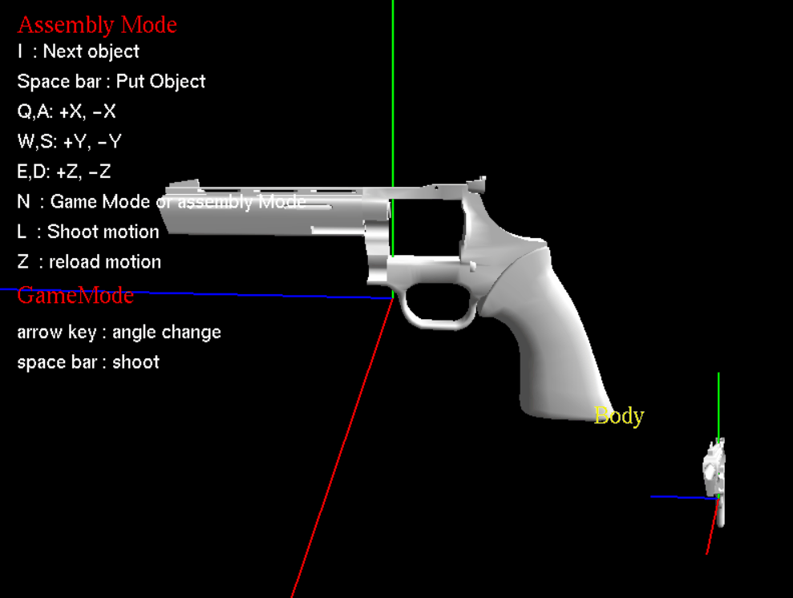
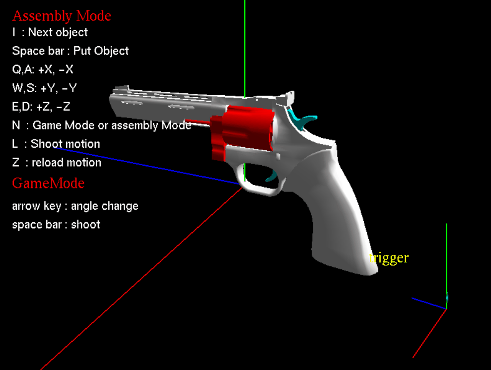

# Computer graphics

## This project is a mini project conducted by Inha University, Department of Information and Communication Engineering, Computer Graphics Design.

## It must be run in a Windows environment and can be run in Visual Studio x64, release settings.

  

  

  

## In addition to those displayed on the screen, shortcut keys can change the color of the current object through the'c' key.

2020 2nd semester
